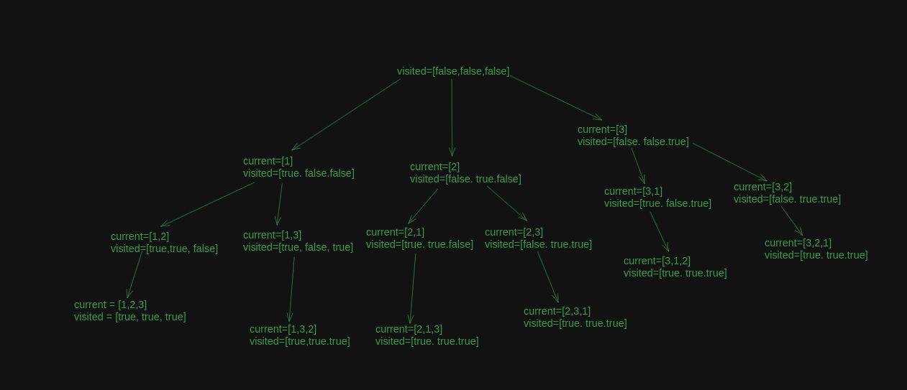

### Intuition

To find all permutation, we need to find combination one number with all others, you can achieve it with recursion and marking used 
numbers in recursion, also when recursion ends you need to pop up last item, we need it to try different permutation.

### Code

```kotlin
    fun permute(nums: IntArray): List<List<Int>> {
        val result = mutableListOf<List<Int>>()
        generatePermutate(nums, LinkedList(), BooleanArray(nums.size), result)

        return result
    }

    private fun generatePermutate(
        nums: IntArray,
        current: LinkedList<Int>,
        visited: BooleanArray,
        result: MutableList<List<Int>>
    ) {
        if (current.size == nums.size) {
            result.add(ArrayList(current))
            return
        }

        for (i in nums.indices) {
            if (!visited[i]) {
                current.add(nums[i])
                visited[i] = true
                generatePermutate(nums, current, visited, result)
                visited[i] = false
                current.pollLast()
            }
        }
    }
```

### Complexity

Time: O(N*N!)

Space: O(N!)

### Example

Input
[1,2,3]

